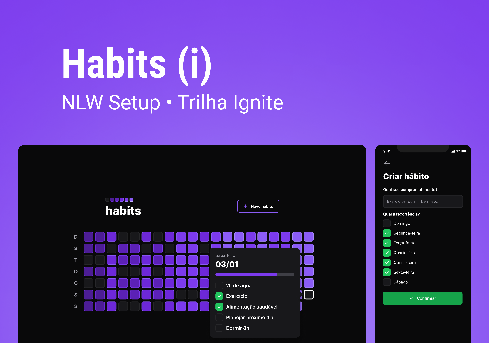

  

  

  <a href="#-tecnologias">Tecnologias</a>&nbsp;&nbsp;&nbsp;|&nbsp;&nbsp;&nbsp;
  <a href="#-layout">Layout</a>&nbsp;&nbsp;&nbsp;|&nbsp;&nbsp;&nbsp;
  <a href="#memo-licença">Licença</a>

# NLW - Setup

## 🚀 Tecnologias

### Front-end
- HTML
- CSS
- TypeScript
- ReactJS
- TailwindCSS
- Radix UI
- DayJS

### Back-end
- NodeJS
- Fastify
- TypeScript
- Prisma
- SQLite
- Zod
- DayJS

### Mobile
- React Native
- Expo
- Native Wind
- React Navigation
- React Native Reanimated
- DayJS

## 🎨 Layout:

Figma: https://www.figma.com/file/t87XssDxaY15o7YMe8s9ri/Habits-(i)-(Community)?node-id=6%3A910&t=BML5NmFvTQecd5i3-1

## :memo: Licença

Esse projeto está sob a licença MIT. Veja o arquivo [LICENSE](LICENSE) para mais detalhes.

---

Feito com ♥ by joaoD3V